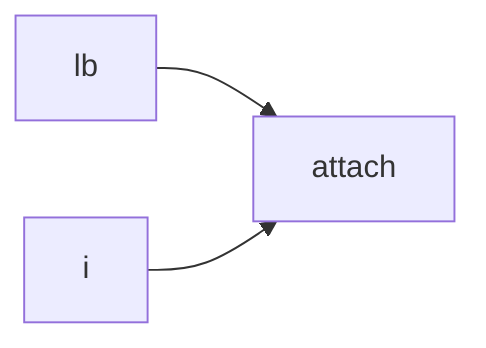
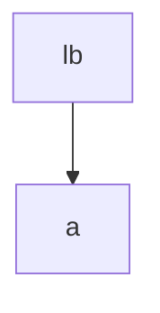
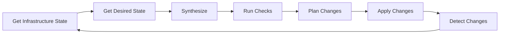

In this chapter, we'll imagine a small language that provides us all the critical features of Infrastructure as Logic.

To keep the scope tight, we will explicitly avoid:
* Pulling state of real-world infrastructure
* Parsing terraform or any other IaC
* Deploying anything

What we will build in this chapter is the core `ial` language, using Prolog as our base.

There are a number of logic programming languages out there; Datalog, miniKanren, Mercury - so why Prolog?

If you're from an academic computer science background, you're likely already somewhat familiar with Prolog. It's the prototypical logic programming language, and has by far the most resources available to learn.

## Resources
The core concept in Infrastructure as Code is the **Resource**. A Resource is data that represents an existing or potential object in some system. This definition is a little vague, because a resource can be anything from a file on a local machine to a VM on a cloud platform.

Resources are usually associated with a name or id so they can be referenced in the definitions of other resources, and a type that defines what kind of resource is being specified.

Consider the following terraform example:

```terraform
resource "aws_s3_bucket" "example" {
  bucket = "my-tf-test-bucket"

  tags = {
    Name        = "My bucket"
    Environment = "Dev"
  }
}
```

In this example:
* The *Name* is `example`
* The *Type* is `aws_s3_bucket`
* The *Params* are the bucket name, and the dictionary of tags

All resources can be distilled down to this triple of *Name*, *Type*, and *Params*.

We can represent the above example in Prolog like this:
```prolog
resource(example, aws_s3_bucket, _{
            bucket: "my-tf-test-bucket",
            tags: _{
              Name: "My bucket",
              Environment: "Dev"
        }}).
```

Here we have defined a **fact** stating that there is a resource with the name, type, and params provided. We can interrogate this program to ask questions about our resources:
```prolog
% What is the type of the resource 'example'?
?- resource(example, TYPE, _).
TYPE=aws_s3_bucket

% What are the names of all aws_s3_buckets?
?- resource(NAME, aws_s3_bucket, _).
NAME=example

% What are the names and types of any resources with the bucket name "my-tf-test-bucket"?
?- resource(NAME, TYPE, _PARAMS), get_dict(bucket_name, _PARAMS, "my-tf-test-bucket").
NAME=example
TYPE=aws_s3_bucket
```

As you can see, we can structurally interrogate the resources we have defined. This makes it possible to filter and search through our resources based on any of its properties.

### Helpers
We can quite easily extend resources by defining helpers. Consider the s3 bucket example above.

We can define a shorthand for querying s3 buckets:
```prolog
aws_s3_bucket(NAME, PARAMS) :-
	resource(NAME, s3_bucket, PARAMS).
```

And another for defining them:
```
resource(NAME, aws_s3_bucket, PARAMS) :-
    s3_bucket(NAME, PARAMS).
```

Now, we can declare our bucket using `s3_bucket`:
```prolog
aws_s3_bucket(example, _{ ... }).

?- aws_s3_bucket(NAME, _).
NAME=example.

?- resource(NAME, TYPE, _).
NAME=example,
TYPE=aws_s3_bucket
```

This doesn't add any functionality, but it is a bit more ergonomic.

## Changesets
To be useful as an IaC tool, we need to be able to compute a changeset. What do we have to change in order to make this code true? We only need to alter the resources that have changed -- anything else is a waste of time.

We need some notion of what exists versus what is desired to achieve this. Let's extend `resource` with a concept of time:
```prolog
% Any bare resources are marked as 'desired'
resource(desired, NAME, TYPE, PARAMS) :-
    resource(NAME, TYPE, PARAMS).
```

There are two states we care about here for the `T` value - `desired` and `existing`. `desired` resources are resources that we want to exist. `existing` resources are those that already exist.

### Calculating changesets
Let's start with our s3 bucket, and say we want to change a tag on it:
```prolog
resource(existing, example, aws_s3_bucket, _{ ..., tags: _{ smells: bad }}).
resource(desired, example, aws_s3_bucket, _{ ..., tags: _{ smells: good }}).
```

There are three kinds of change we need to capture:
* When something new is created
* When something existing is modified
* When something existing is deleted

### Finding modified resources
Fortunately, finding a modified resource is not too hard:
```prolog
update(NAME, TYPE, PARAMS, PARAMS_NEXT) :-
    resource(existing, NAME, TYPE, PARAMS),
    resource(desired, NAME, TYPE, PARAMS_NEXT),
    PARAMS =\= PARAMS_NEXT.
```

When we query `modified`, we are now returned a list of the resources that:
* Already exist
* We still desire to exist
* Have different params

It's worth noting here that we are using the `NAME` and `TYPE` as an implicit composite key, but we are not enforcing uniqueness on this[^1].

Now we know which resources need to be updated, we can pass them off to a provider[^2] to be executed.

### Creating resources
Making new resources is similarly easy - we need to find resources that don't currently exist, but that we desire:
```
create(NAME, TYPE, PARAMS) :-
	\+ resource(existing, NAME, TYPE, _), % The resource does not already exist!
	resource(desired, NAME, TYPE, PARAMS).
```

Again, we can pass these to a provider to create.

### Deleting Resources
To get rid of resources, we invert creation:
```prolog
delete(NAME, TYPE, PARAMS) :-
	resource(existing, NAME, TYPE, _),
	\+ resource(desired, NAME, TYPE, PARAMS). % We no longer desire the resource to exist
```

Which we then pass to the provider to delete. 

Now that we have the three basic operations, we can do a very basic listing of each and send them to the provider to act upon. Note that we are not capturing dependencies between resources at all here, so there is still more work to do for any changes we make to be successful; for example, if we reference a resource, it needs to exist first!

We will come back to this soon in our first look at temporal logic.

## Creating resources from other facts
A core part of synthesis is creating resources from other facts. We can express relationships or properties that we want to exist, and then use those to derive resources.

For our example, we will consider a vm instance that allows access via a security group. We could write it like this:
```prolog
resource(instance, aws_instance, ...).
resource(sg, aws_security_group, _{ name: "allow_tls" }).
resource(allow_tls_rule, aws_security_group_rule, _{ security_group: sg, from_port: 443, to_port: 443, protocol: tcp }).
resource(sg_attach, aws_security_group_attachment, _{ security_group: sg, instance: instance }).
```

This is not dissimilar to how you'd write it in terraform; a list of resources that reference each other. In a CDK, you might go a step further and create a function or method that creates the intermediate resource for you.

After all, what you actually care about is that `instance` is accessible on port `443`.

We can write reusable rules that generate resources to replicate the same behaviour as seen in a CDK with a function or method.[^3]

```prolog
resource(instance, aws_instance, ...).
allow_tls(instance).

% Pseudocode! See chapter 4 for a real implementation.
resource(allow_tls_sg, aws_security_group, ...) :-
	allow_tls(_).

resource(allow_tls_sg_rule, aws_security_group_rule, _{ security_group: allow_tls_sg, from_port: 443, to_port: 443, protocol: tcp }) :-
	allow_tls(_).

resource(allow_tls_sg_attach, aws_security_group_attachment, _{ security_group: allow_tls_sg, instance: I }) :-
	allow_tls(I).
```

Now any time we create an `allow_tls/1` fact, a security group, a rule, and an attachment to the target will be created.

### Creating resources from rules
We can go a step above this and create resources whenever a rule is satisfied.

Let's say (for whatever reason) we want ALL our instances to allow TLS access. We can do that pretty easily:
```prolog
allow_tls(INSTANCE) :-
	resource(INSTANCE, aws_instance, _).
```

Now any instance we create will get the security group, rule, and attachment we defined above. This is a jump in power from CDK-style constructs, as we can now logically apply transformations to any resource based on rules we specify.

## Checking Invariants
It's useful to be able to check that our resources are constructed correctly, especially when we are working on compliance and governance activities.

A common security check is testing that there are no publicly accessible SSH ports on an instance. Let's first construct a more generic version of `allow_tls` called `allow`:
```prolog
resource(instance, aws_instance, ...).
allow(22, instance).

% Pseudocode! See chapter 4 for a real implementation.
resource(allow_sg, aws_security_group, ...) :-
	allow(_, _).

resource(allow_sg_rule, aws_security_group_rule, _{ security_group: allow_tls_sg, from_port: PORT, to_port: PORT, protocol: tcp }) :-
	allow_tls(PORT, _).

resource(allow_tls_sg_attach, aws_security_group_attachment, _{ security_group: allow_tls_sg, instance: I }) :-
	allow_tls(_, I).
```

We can invert these rules to turn `allow` into a rule that finds instances that allow access to a given port.[^4]
```prolog
allow(PORT, INSTANCE) :-
	resource(INSTANCE, aws_instance, _),
	resource(SG, aws_security_group, _),
	% Pseudocode: this kind of partial structural matching requires a bit more code. We'll cover that in chapter 3.
	resource(_, aws_security_group_rule, _{ security_group: SG, from_port: PORT, to_port: PORT }),
	resource(_, aws_security_group_attachment, _{ security_group: SG, instance: INSTANCE }).
```

Now we can ask if there are any instances we know about that meet the criteria:
```prolog
?- allow(22, I).
I = instance.
```

We will extend this later on in chapter 3 by turning it into a powerful verification system. For now, knowing we can find things that match rules is enough.

## Temporal Reasoning
I hinted in the Changesets section that ordering and dependency need to be addressed for changes to actually work. You can't create a resource that references a target resource if the target resource doesn't exist!

In our above example, we can't attach a security group to an instance if that instance doesn't exist.

For this exercise we will avoid introspecting structures and instead model explicit dependencies. We'll step back to a more abstract example. Consider the following:
```prolog
resource(lb, load_balancer, _).
resource(i, instance, _).
resource(attach, lb_target_attachment, _{ instance: i, load_balancer: lb}).
```

In this example we have an instance and a load balancer, and an attachment between them. There are some orders that it isn't valid to deploy these; we can't deploy `attach` until both `lb` and `i` exist!

Let's model that dependency explicitly:
```prolog
depends_on(attach, lb).
depends_on(attach, i).
```

If you squint a little, you can see a graph, where each `resource` is a node and each `depends_on` is an edge.



This may look familiar -- and that's because this is a directed acyclic graph, or DAG. Terraform uses these under the hood to decide what order to create, delete, or modify resources.

From this DAG, we can tell:
* `attach` needs both `lb` and `i` to exist before it can be created
* `lb` and `i` don't depend on anything, so we can create them at the same time

We can walk that DAG topologically to produce an ordering that respects dependency. We'll properly define that later, but for now let's pretend we have a rule called `plan` that does this for us:
```prolog
?- plan(STEPS) :-
STEPS=[
  [create(lb), create(i)],
  [create(attach)]
]
```

We will define `plan` in chapter 5, but for now you can see that we have a 2-step deployment.

### Holding invariants over time
A common task in the DevOps playbook is the zero-downtime deploy. One of the really exciting things about Infrastructure as Logic is that you can talk about the properties you want to see without explicitly defining the behaviour.

We will go deeper in to this in chapter 5, but here is a toy example to get you thinking. Consider we have a load balancer and an instance:


We want to replace instance a with a new instance, b, but we want to do so **without downtime**. Generally we would have to define this behaviour explicitly, but in IaL we instead add a constraint:
```prolog
always(has_live_target(lb)).
```

There's a lot of hand-waving here, but bear with me:
* `has_live_target` is true iff `lb` has an active instance attached to it
* `always` is a temporal modifier that expresses that we always want this to be true.

Let's consider the start and end goals:
```prolog
resource(existing, a, instance, ...).
resource(existing, lb, load_balancer, _{ target: a }).

resource(desired, b, instance, ...).
resource(desired, lb, load_balancer, _{ target: b }).
```

And imagine (not for long, we'll define it for real in chapter 5!) that we have extended plan to take in to account the temporal constraints:
```prolog
?- plan(STEPS).
STEPS = [
  [create(a)],
  [attach(lb, a)],
  [detach(lb, b)],
  [destroy(b)]
]
```

That's right - we will derive **zero-downtime deployments** from a simple rule, and `ial` will figure it out for us.

## Reactive Infrastructure
An easy extension to `ial` is to turn it into a *live system*, one that reacts to changes.

The base `ial` implementation toolchain is:


We can enhance that into a live system by adding:


In our earlier example of adding security group rules to new instances, in this system we could detect when a new instance is added and automatically add the rule.

There are systems out there that already do this -- but not as an integral part of an IaC tool!
## Up Next
The following sections, Infrastructure as Data, Constraints and Invariants, Planning and Synthesis, Time and Change, and Language and Tooling, are a detailed implementation guide for making the tools presented in this chapter real.

You should read them in order, as each builds upon the last. 

[^1]: We'll explore this more in chapter 4 when we think more about synthesis. Having uniquely identified resources sounds like a useful property, but there is more than one way to uniquely identify a resource!

[^2]: Providers map data about changes to actions such as API calls. They are covered briefly in Part 2, and much more comprehensively in Part 6. 

[^3]: This example completely ignores one of the hard problems in computer science: naming things. Don't worry, we'll come back to it and make it actually work.

[^4]: To prevent circular logic and infinite loops, we'd usually define these after any facts or introduce cuts to prevent backtracking. More on that in Chapter 3.
